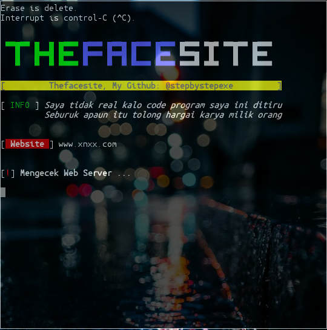

# Thefacesite:
*Deface adalah teknik mengganti atau menyisipkan file pada server, teknik ini dapat dilakukan karena terdapat lubang pada sistem security yang ada di dalam sebuah aplikasi.*
#### Screenshot:

#### Cara Menginstall:
```
pkg upadate && pkg upgrade
apt-get install git
apt-get install python2
git clone https://github.com/stepbystepexe/Thefacesite
cd Thefacesite
ls
python2 thefacesite.py
```
#### Kontak:
+ Email d_q16x@outlook.co.id
+ WhatsApp https://tinyurl.com/wel4alo
#### Paypal:
+ Onclick https://bit.ly/3dcEQcN
#### LiberaPay:
<noscript><a href="https://liberapay.com/stepbystepexe/donate"></a></noscript>
>**Created by Nedi Senja**
